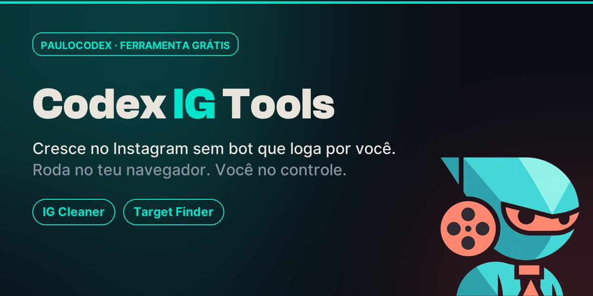

  

<h1 align="center">Codex IG Tools</h1>

  Crescimento de Instagram que roda <b>no console do seu próprio navegador</b> — na sua sessão logada. 
  Sem servidor, sem senha, sem bot que loga por você. <b>Você continua no controle.</b>

  
  
  
  

---

## ⚡ Começar em 10 segundos

1. Baixe (ou copie) o arquivo **[`codex-ig.js`](codex-ig.js)** — botão **Raw** → Ctrl+A → Ctrl+C.
2. Abra o **instagram.com** já **logado**, no computador.
3. Tecla **F12** → aba **Console**.
4. **Cole** o conteúdo → **Enter**.

Um painel abre no canto superior direito. Pronto. Nada é instalado.

---

## 🧰 Três ferramentas num painel só

| Aba | O que faz |
|---|---|
| **📊 Painel** | Os números da sua conta: seguindo, seguidores, **quem não te segue de volta**, mútuos e a razão saudável. |
| **🧹 Limpar** | Deixa de seguir quem **não te retribui**, de forma **ritmada** (delay + pausa anti-bloqueio + limite/dia + parada automática se o Instagram reclamar). |
| **🎯 Achar alvos** | Você dá **um concorrente do seu nicho** → devolve os **seguidores dele** (= seu público-alvo) como lista clicável, já tirando quem você segue, com um **comentário-modelo** por segmento. |

> Prefere separado? Os scripts individuais estão em **[`tools/`](tools/)** (`codex-ig-cleaner.js`, `codex-target-finder.js`).

---

## 🔒 Seguro por design

- **Roda local, na sua sessão.** Usa os cookies que **já estão** no navegador (lidos em tempo de execução, **nunca gravados nem enviados**). Nada trafega para servidor nenhum. O `x-ig-app-id` usado é o público do IG web, igual para qualquer usuário.
- **Ver é leitura.** Listar números e não-seguidores não altera nada.
- **Unfollow é ritmado.** Automação de follow/unfollow é gray-area do ToS do Instagram — por isso o Limpar vai devagar (delay + jitter + pausa de 5 min a cada lote + limite por vez + parada em `429/400`). Use na **sua** conta, em volume humano. Você assume o risco.
- **Achar alvos não interage por você** — de propósito. Curtir/comentar em massa por script é o que bane. A parte segura (achar o *quem*) é automatizada; o clique humano é seu.

Não use para spam, assédio, ou em contas que não são suas.

---

## 🗺️ Roadmap

Ideias em avaliação para as próximas versões:

- [ ] **Melhor horário** — quando seus seguidores estão online.
- [ ] **Pesquisa de hashtag** — hashtags do nicho por volume e concorrência.
- [ ] **Quem deixou de me seguir** — comparação entre execuções.
- [ ] **Exportar CSV** — levar as listas pra planilha.
- [ ] **Whitelist** — nunca dar unfollow em contas marcadas.

Sugestões? Abra uma *issue* ou fale em **contato@paulocodex.com**.

---

## 🛠️ Stack

JavaScript puro (Web API interna do Instagram via `fetch` na sessão logada) · painel injetado no DOM com CSS próprio · **zero dependências · zero backend · zero build**.

---

  Feito no estúdio <a href="https://paulocodex.com">Paulocodex</a> · © 2026 Paulo Batista · Licença MIT

